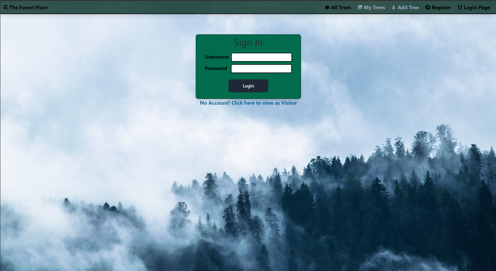

# The Forest Floor

_A tree management system_

## Prerequisites
---
1. A github account
2. Access to a Linux based computer or VM
2. [VS Code](https://code.visualstudio.com/download) or [equivalent](https://www.g2.com/products/visual-studio-code/competitors/alternatives)
3. [Docker Desktop](https://www.docker.com/products/docker-desktop/)

## First Steps

---

Installation

- Fork and Clone this repo into a directory of your choice
- Navigate inside the chosen directory to the `front-end` folder and run `npm install`
- Return to the main directory then navigate to the `back-end` folder and run `npm install`

Initialization

- Return to the main directory and run `docker compose up`
- Note any displayed errors and refer to the potential hiccups section below if necessary

## Using the application

---

Once the application is running successfully...

- Using your browser of choice type (or copy) `http://localhost:3000/login` to the browser

- You should be navigated to a page similiar to the one shown below
> If not... you should try revisiting the installation steps above or the potential hiccups section below



## Using the system

---

### User Accounts
- The Forest Floor allows logging in with a manager account or viewing the page as a visitor
- Managers are able to View, Edit and Delete tree entries. Visitors can only view entries.
- To login in as a Manager use one of the 4 pregenerated demo accounts found in the table below

| Username          |           Password | 
|:------------------|:-------------------|
| username          | password           |
| SorcererSupreme1  | TonyStarkSucks     | 
| FriendlyNeighbor2 | AuntMayCanNeverDie |
| Batman            | ImBatman           |

> Note: Successful logins create session cookies. Want to use a different account? Make sure you log out first!

### Home Screen Viewing all trees
  - After a successful login, or by clicking the visitor link you will be navigated to the home page. 
  - This page displays all trees currently stored in the database.
  - Clicking any tree will direct you to the detail page for that particular tree.
  - After navigating away clicking "The Forest Floor" on the navbar will bring you back. 

### Individual Tree View
  - This page displays details, description, and an image of the chosen tree.
  - Trees with no provided image url will display a default tree clip art, however, broken links will show alt text.
  - Pressing the Previous or Next will take you to the tree with the next closest tree by id.
  - The editing and delete buttons are explained in detail below.

### Editing a tree
  > Note: that the Edit button will be greyed out for visitors
  - This button will pull up a form for editing the info about the tree.
  - Any empty forms will be disregarded.
  - The quantity field requires a positive whole number before the edit will accept the change.

### Deleting a tree
  > Note: that the Delete button will be greyed out for visitors
  - Selecting this button and accepting the prompt will permanently delete the record.
  - After deletion you will be navigated back to the home page.

### Adding a tree
  > Note: that the Add Tree button will be greyed out for visitors
  - Adding a tree requires the title, quantity, and description fields be filled.
  - The quantity field requires a positibe whole number before allowing the addition.

## Stopping the system
---
 - To stop the application return to the console you initially spun up the program in and press ```ctrl + c``` to stop the docker container.  If you don't believe me you can subsequently run ```docker compose down``` to make sure once and for all.

## Pontential Hiccups or Roadblocks

---
> Weird errors can occur if the application can't find expected resources.  If any console inputs after running ```docker compose up``` indicate that a dependency is unavailable, navigate into the relevant folder (back-end or front-end) and re-run the ```npm install``` command. (At least one time I had to uninstall and reinstall a dependency so be diligent!)

> One possible side-effect of abstracting the creation of a database is the possiblity of data conflicts.  This issue cannot be fixed by stopping and restarting the application.  To resolve this issue connect directly to the database using the following [procedure](https://stackoverflow.com/questions/37694987/connecting-to-postgresql-in-a-docker-container-from-outside). Once connected, type ```\l``` to see list all databases.  Delete the ```items``` database with the ```DROP DATABASE items;``` command.  Follow up by creating a new items database with the ```CREATE DATABASE items```.  This effectively reboots the database.  (This shouldn't be an issue... but if it does happen this is the fix action)

>


## Data Sources
All images and data were pulled from [wikipedia](https://en.wikipedia.org/wiki/Category:Trees_of_North_America), except the quantities... those were random

Oh.. and also the background trees... those came from [here](https://www.pexels.com/photo/trees-with-fog-158672/)

And umm.... and [this](https://pixabay.com/vectors/oak-tree-forest-wood-plant-nature-156092/), and [this](https://www.flaticon.com/free-icon/tree_489969?term=tree&page=1&position=9&origin=tag&related_id=489969)...

Alright, that's it explore away!

